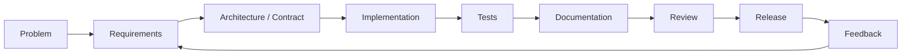
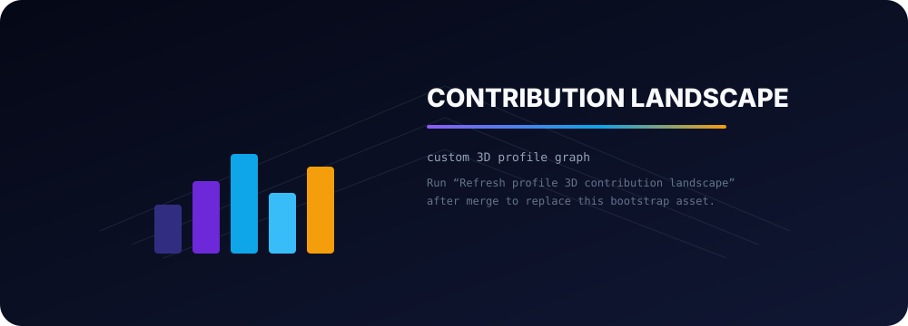

<p align="center">
  <picture>
    <source media="(prefers-color-scheme: dark)" srcset="./assets/enzo-engineering-hero.svg">
    <source media="(prefers-color-scheme: light)" srcset="./assets/enzo-engineering-hero-light.svg">
    
  </picture>
</p>

<p align="center">
  <a href="https://enzopinotti.dev"></a>
  <a href="mailto:enzopinottii@gmail.com"></a>
  
  <a href="https://github.com/Enzopinotti/Enzopinotti/actions/workflows/profile-quality.yml"></a>
</p>

<h1 align="center">Hi, I'm Enzo 👋</h1>
<p align="center">
  <strong>Full Stack / Product Engineer</strong> · Industrial Engineer · Systems Engineering in progress
</p>
<p align="center">
  I turn messy real-world processes into software that is clear, testable, observable and useful.
</p>

---

## 01 // CURRENT MISSION

```text
BUILDING
├─ product systems      → operational workflows, permissions, collaboration
├─ AI inside products   → tools, memory, voice, retrieval, structured extraction
├─ platform foundations → APIs, contracts, documentation, integrations
└─ delivery discipline  → Docker, CI, regression testing, release evidence
```

My main current work is a **private modular work-management product** spanning scheduling, tasks, collaboration, workforce operations, integrations and an AI assistant.

I work across requirements, product decisions, frontend, backend, data integrity, infrastructure and release qualification. The source is private, so this profile intentionally exposes engineering themes rather than private implementation details.

---

## 02 // ENGINEERING MAP

| Product systems | Platform & data |
| --- | --- |
| React / Vite product surfaces | Node.js / Fastify / Express services |
| Dense operational workflows | REST APIs and explicit contracts |
| Responsive + accessible UI | PostgreSQL / SQL data integrity |
| Tasks, scheduling, collaboration | Auth, tenancy, RBAC and integrations |

| AI systems | Delivery & operations |
| --- | --- |
| Provider abstraction | Docker-based environments |
| Capability / tool execution | Linux / VPS / Nginx |
| Confirmation boundaries | CI and regression gates |
| Memory, retrieval and voice | Release and operational documentation |

I care less about collecting frameworks and more about understanding **where authority lives**, how failures behave, what can be verified, and how another developer can continue the work without guessing.

---

## 03 // SELECTED BUILDS

### 🌐 [Portfolio — enzopinotti.dev](https://enzopinotti.dev)
**Full-stack product + production operations**

React + Node.js portfolio with SQL-backed data, authentication/integration work, Docker environments and production deployment tooling.

→ [Source: Enzopinotti/portafolio-personal](https://github.com/Enzopinotti/portafolio-personal)

### 🎨 [Mora Petraglia — Landing + CMS](https://github.com/Enzopinotti/Mora-Petraglia-Landing)
**Product interface + content operations + integrations**

React + TypeScript public portfolio paired with a private `/admin` CMS, using Google Apps Script as an HTTP API and Google Sheets / Drive as operational content services.

### 🧠 [Bitora](https://github.com/Enzopinotti/Bitora)
**Algorithms + testable product behavior**

Educational full-stack laboratory for comparing **Huffman** and **Shannon-Fano** lossless compression through an interactive React UI, Express API, algorithm tests, file-format work and Docker execution.

> Older public repositories are being reviewed and classified so the profile clearly distinguishes **current work**, **reusable tooling**, **experiments** and **historical projects**. The Node.js starter modernization will join this section only after its public `main` branch matches that standard.

---

## 04 // HOW I BUILD



The loop matters more to me than the individual tool. A good implementation should leave behind enough evidence — tests, contracts, docs and decisions — that the next iteration is easier than the previous one.

---

## 05 // ACTIVITY LANDSCAPE

<p align="center">
  <picture>
    <source media="(prefers-color-scheme: dark)" srcset="./profile-3d-contrib/profile-enzo-dark.svg">
    <source media="(prefers-color-scheme: light)" srcset="./profile-3d-contrib/profile-enzo-light.svg">
    
  </picture>
</p>

The landscape uses a custom palette over the MIT-licensed [`github-profile-3d-contrib`](https://github.com/yoshi389111/github-profile-3d-contrib) generator. Its refresh workflow is manual, SHA-pinned, uses the GitHub Actions bot identity and commits only when generated assets actually change.

The visualization is not the goal. The activity behind it should keep following the same pattern:

```text
real issue → scoped branch → meaningful commits → validation → review → merge
```

---

## 06 // CORE TOOLCHAIN

<p>
  
  
  
  
  
  
  
  
  
  
</p>

<details>
<summary><strong>Additional experience</strong></summary>
<br />

JavaScript · Sass / CSS · MongoDB · Prisma / ORM patterns · OAuth · Google Workspace integrations · Python scripting · WordPress · Shopify · SEO / analytics · Figma-to-code

</details>

---

## 07 // ENGINEERING PRINCIPLES

```text
01. Understand the business/process before choosing the technology.
02. Keep authority explicit: contracts, permissions, ownership and data boundaries.
03. Prefer recoverable, reviewable changes over giant rewrites.
04. Treat tests and documentation as part of the product.
05. Automate evidence, not activity for activity's sake.
06. Build for the person who has to understand the system six months later.
```

---

<p align="center">
  <strong>Build useful systems. Make the important behavior explicit. Keep improving the loop.</strong>
</p>

<p align="center">
  <a href="https://enzopinotti.dev">Portfolio</a> · <a href="mailto:enzopinottii@gmail.com">Email</a>
</p>
