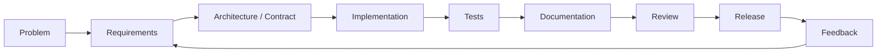

<p align="center">
  
</p>

<p align="center">
  <a href="https://enzopinotti.dev"></a>
  <a href="mailto:enzopinottii@gmail.com"></a>
  
</p>

<h1 align="center">Hi, I'm Enzo 👋</h1>
<p align="center">
  <strong>Full Stack / Product Engineer</strong> · Industrial Engineer · Systems Engineering in progress
</p>
<p align="center">
  I like turning messy real-world processes into software that is clear, testable, observable and actually useful.
</p>

---

## 01 // CURRENT MISSION

```text
BUILDING
├─ product systems      → operational workflows, permissions, collaboration
├─ AI inside products   → tools, memory, voice, retrieval, structured extraction
├─ platform foundations → APIs, contracts, documentation, integrations
└─ delivery discipline  → Docker, CI, regression testing, release evidence
```

My main current work is a **private modular work-management product** that brings together tasks, scheduling, collaboration, workforce operations, integrations and an AI assistant.

I work across the whole path from requirements and product decisions to frontend, backend, data integrity, infrastructure and release qualification. The source is private, so this profile intentionally shares only public-safe engineering themes.

---

## 02 // ENGINEERING MAP

| Product systems | Platform & data |
| --- | --- |
| React / Vite product surfaces | Node.js / Fastify / Express services |
| Dense operational workflows | REST APIs and explicit contracts |
| Responsive + accessible UI | PostgreSQL / SQL data integrity |
| Tasks, scheduling, collaboration | Auth, tenancy, RBAC and integrations |

| AI systems | Delivery & operations |
| --- | --- |
| Provider abstraction | Docker-based environments |
| Capability / tool execution | Linux / VPS / Nginx |
| Confirmation boundaries | CI and regression gates |
| Memory, retrieval and voice | Release and operational documentation |

I care less about collecting frameworks and more about understanding **where authority lives in a system**, how failures behave, what can be tested, and how another developer can continue the work without guessing.

---

## 03 // SELECTED BUILDS

### 🌐 [Portfolio — enzopinotti.dev](https://enzopinotti.dev)

A full-stack personal portfolio that evolved beyond a static website into a React + Node.js application with SQL-backed data, authentication/integration work, Docker environments and production deployment tooling.

**Repository:** [Enzopinotti/portafolio-personal](https://github.com/Enzopinotti/portafolio-personal)

### 🧠 [Bitora](https://github.com/Enzopinotti/Bitora)

An educational full-stack laboratory for comparing **Huffman** and **Shannon-Fano** lossless compression. It combines an interactive React interface, an Express API, algorithm tests, file-format work and Docker-based execution.

### 🧰 [Plantilla-de-Proyecto](https://github.com/Enzopinotti/Plantilla-de-Proyecto)

An older backend starter currently being rebuilt as a smaller, modern and reusable Node.js / TypeScript service foundation with real quality gates instead of inherited boilerplate.

> I am actively reviewing older public repositories so this profile clearly separates **current work**, **reusable tooling**, **experiments** and **historical projects**.

---

## 04 // HOW I BUILD



The loop matters more to me than the individual tool. A good implementation should leave behind enough evidence — tests, contracts, docs, decisions — that the next iteration is easier than the previous one.

---

## 05 // ACTIVITY LANDSCAPE

<p align="center">
  
</p>

This graph uses a custom Enzo palette over the MIT-licensed [`github-profile-3d-contrib`](https://github.com/yoshi389111/github-profile-3d-contrib) generator. The refresh workflow uses the GitHub Actions bot identity and only commits when the generated asset actually changes.

The graph is a visualization, not the goal. I want the activity behind it to keep following the same pattern:

```text
real issue → scoped branch → meaningful commits → validation → review → merge
```

---

## 06 // CORE TOOLCHAIN

<p>
  
  
  
  
  
  
  
  
  
  
</p>

<details>
<summary><strong>Additional experience</strong></summary>
<br />

JavaScript · Sass / CSS · MongoDB · Prisma / ORM patterns · OAuth · Google Workspace integrations · Python scripting · WordPress · Shopify · SEO / analytics · Figma-to-code

</details>

---

## 07 // ENGINEERING PRINCIPLES

```text
01. Understand the business/process before choosing the technology.
02. Keep authority explicit: contracts, permissions, ownership and data boundaries.
03. Prefer recoverable, reviewable changes over giant rewrites.
04. Treat tests and documentation as part of the product.
05. Automate evidence, not activity for activity's sake.
06. Build for the person who has to understand the system six months later.
```

---

<p align="center">
  <strong>Build useful systems. Make the important behavior explicit. Keep improving the loop.</strong>
</p>

<p align="center">
  <a href="https://enzopinotti.dev">Portfolio</a> · <a href="mailto:enzopinottii@gmail.com">Email</a>
</p>
