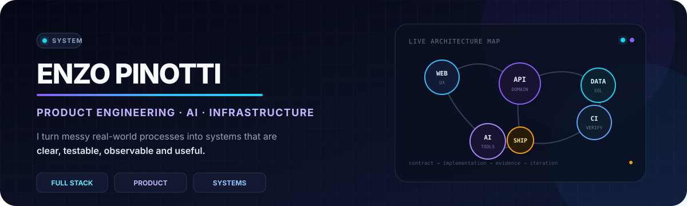
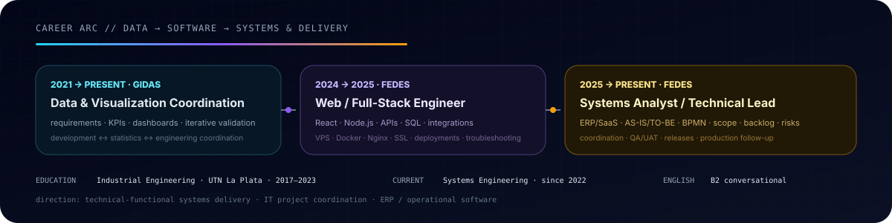
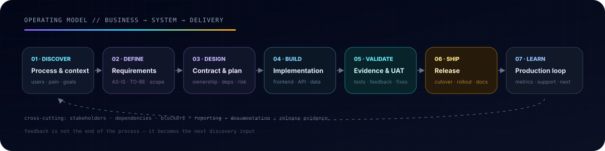

<p align="center">
  <picture>
    <source media="(prefers-color-scheme: dark)" srcset="./assets/enzo-engineering-hero.svg">
    <source media="(prefers-color-scheme: light)" srcset="./assets/enzo-engineering-hero-light.svg">
    
  </picture>
</p>

<p align="center">
  <a href="https://enzopinotti.dev"></a>
  <a href="mailto:enzopinottii@gmail.com"></a>
  
  <a href="https://github.com/Enzopinotti/Enzopinotti/actions/workflows/profile-quality.yml"></a>
</p>

<h1 align="center">Hi, I'm Enzo 👋</h1>
<p align="center">
  <strong>Systems Analyst / Technical Lead · Full-Stack / Product Engineer</strong>
</p>
<p align="center">
  Industrial Engineer · Systems Engineering in progress · English B2
</p>
<p align="center">
  I work across <strong>business processes, software systems, data, infrastructure and delivery</strong>.
</p>

---

## 01 // CURRENT MISSION

```text
DISCOVER → DEFINE → BUILD → VERIFY → SHIP → LEARN

PRODUCT SYSTEMS      operational workflows, collaboration, permissions
TECHNICAL-FUNCTIONAL requirements, process analysis, scope and coordination
AI INSIDE PRODUCTS   tools, memory, voice, retrieval, structured execution
DELIVERY DISCIPLINE  risks, blockers, UAT, CI, releases and follow-up
```

My current focus is building and evolving **operational software and ERP/SaaS-style systems** that have to survive real users, changing requirements, permissions, data constraints, integrations and production releases.

What differentiates my profile is the bridge between **business context and technical execution**: I can move from user/stakeholder discovery, AS-IS / TO-BE process analysis and acceptance criteria into frontend/backend work, APIs, data, infrastructure, QA/UAT, release qualification and production follow-up.

Two completed public modernization cases now show the method from different angles. **[El_Nucleo_Web](https://github.com/Enzopinotti/El_Nucleo_Web)** rebuilt a 2022 HTML/SCSS project into a production-qualified React application while preserving historical provenance. **[Web-de-profesores](https://github.com/Enzopinotti/Web-de-profesores)** took the opposite architectural lesson: a 2023 JavaScript/localStorage simulator matured into a safe, tested local teaching workspace with Vite + TypeScript **without adding React, backend authentication or a database that the product did not need**.

Both preserve their historical baselines, qualify real deployments and keep rollback evidence. I am applying the same evidence-first method across older repositories without forcing the same stack onto every project. The next full lane is `Pint.ar_Ecommerce`, tracked in **[Repository portfolio roadmap — 2026](./docs/repository-portfolio-roadmap-2026.md)**.

---

## 02 // CAREER ARC

<p align="center">
  <picture>
    <source media="(prefers-color-scheme: dark)" srcset="./assets/career-arc.svg">
    <source media="(prefers-color-scheme: light)" srcset="./assets/career-arc-light.svg">
    
  </picture>
</p>

My path has been intentionally transversal:

- **GIDAS · Data & Visualization Coordination (2021 → present):** requirements, KPIs, data sources, dashboards/reports and iterative validation while coordinating development, statistics and engineering perspectives.
- **Fedes · Web / Full-Stack Development (2024 → 2025):** React, Node.js, REST APIs, SQL/data work, integrations and production infrastructure including VPS, Docker, Nginx, SSL and troubleshooting.
- **Fedes · Systems Analyst / Technical Lead (2025 → present):** ERP/SaaS evolution, requirements, BPMN, AS-IS / TO-BE, use cases, user stories, business rules, acceptance criteria, backlog/scope, risks, dependencies, blockers, development coordination, QA/UAT, releases and production support.

That progression is also why I am increasingly interested in **technical project coordination, IT project administration and functional/system analysis roles** around ERP and complex software implementations — without losing the ability to go deep technically when needed.

---

## 03 // SELECTED BUILDS

### 🎬 [El Núcleo — 2022 → 2026 reconstruction](https://github.com/Enzopinotti/El_Nucleo_Web)
**Evolutionary modernization + provenance + production-qualified delivery**

A completed public legacy-to-modern case that keeps the original HTML/SCSS source auditable while the current product runs from **Node.js 24, pnpm 11.26.0, React 19, Vite 8, TypeScript 6, modern Sass and Vitest**. The repository finishes with **30/30 permanent tests**, immutable-SHA CI, provenance/truth-boundary contracts, versioned Netlify deployment policy and a real production smoke in Chrome under enforced CSP.

The engineering constraint is part of the result: historical copy and media keep explicit source context instead of being silently rewritten into present-day commercial claims. The modern deployment is live at **[el-nucleo-producciones.netlify.app](https://el-nucleo-producciones.netlify.app/)** while the 2022 baseline remains recoverable.

### 🎓 [Modderhouse — 2023 → 2026 teaching workspace](https://github.com/Enzopinotti/Web-de-profesores)
**Fit-for-purpose modernization + recoverable local data + browser-qualified delivery**

A completed JavaScript-learning project that now preserves its exact 2023 baseline while the maintained 2026 workspace uses **Node.js 24, pnpm 11.26.0, Vite 8 and TypeScript 6** with no framework inflation. The current product removes fake password/auth semantics, adds versioned storage recovery, backup/restore, stable-ID editing, undo and neutral classroom summaries, and finishes with **41/41 tests** plus a real Chrome production smoke at 360 / 768 / 1440.

The deployment itself became part of the engineering story: when GitHub's legacy Pages publisher competed with the custom workflow, the repository was changed so both publication paths resolve to a verified equivalent 2026 artifact while the original 14-file project remains byte-for-byte auditable under `historical/2023/`.

### 🌐 [Portfolio — enzopinotti.dev](https://enzopinotti.dev)
**Full-stack product + production operations**

React + Node.js product surface with structured data, authentication/integration work, Docker environments and production deployment tooling.

→ [Source: Enzopinotti/portafolio-personal](https://github.com/Enzopinotti/portafolio-personal)

### 🎨 [Mora Petraglia — Landing + CMS](https://github.com/Enzopinotti/Mora-Petraglia-Landing)
**Frontend product experience + content operations + integrations**

React + TypeScript public portfolio paired with a private `/admin` CMS, using Google Apps Script as an HTTP API and Google Sheets / Drive as operational content services.

### 🧠 [Bitora](https://github.com/Enzopinotti/Bitora)
**Algorithms + testable product behavior**

Educational full-stack lab comparing **Huffman** and **Shannon-Fano** lossless compression through an interactive React UI, Express API, algorithm tests, file-format handling and Docker execution.

### 🧰 [Plantilla de Proyecto — Node Service Starter](https://github.com/Enzopinotti/Plantilla-de-Proyecto)
**Reusable backend foundation + explicit runtime contracts**

A deliberately small **Node.js 22 + TypeScript + Fastify 5 + Zod** HTTP starter with validated configuration, deterministic `/health`, structured 404/500 behavior, graceful shutdown, Vitest coverage, `npm ci` reproducibility and a read-only SHA-pinned GitHub Actions quality gate. Product-specific auth, databases, mail, queues and realtime dependencies stay out of the baseline until they are actually needed.

> Selected builds are intentionally limited to a small set of repositories that show different engineering signals: product delivery, integrations, algorithms, evolutionary modernization and reusable foundations.

---

## 04 // BUILD SIGNAL LANDSCAPE

<p align="center">
  <picture>
    <source media="(prefers-color-scheme: dark)" srcset="./profile-3d-contrib/profile-enzo-dark.svg?v=a8777a00eac8">
    <source media="(prefers-color-scheme: light)" srcset="./profile-3d-contrib/profile-enzo-light.svg?v=a8777a00eac8">
    
  </picture>
</p>

The graph is a compact view of public engineering activity, not a goal by itself. The pattern behind it matters more:

```text
real issue → scoped branch → meaningful commits → validation → review → merge
```

The landscape uses the MIT-licensed [`github-profile-3d-contrib`](https://github.com/yoshi389111/github-profile-3d-contrib) engine with a custom palette, profile-specific branding and manual-only refresh.

---

## 05 // HOW I WORK

<p align="center">
  <picture>
    <source media="(prefers-color-scheme: dark)" srcset="./assets/how-i-work.svg">
    <source media="(prefers-color-scheme: light)" srcset="./assets/how-i-work-light.svg">
    
  </picture>
</p>

I usually work through the full delivery loop rather than one isolated layer. Typical responsibilities include **requirements discovery, process documentation, BPMN / AS-IS / TO-BE, business ↔ technology translation, prioritization, development coordination, dependency and risk tracking, QA/UAT, release follow-up, production troubleshooting and reporting**.

In ERP and operational-system contexts I am especially comfortable acting as the person who can understand the process with users, translate it into a technical contract, coordinate implementation and then validate what actually reaches production.

I do **not** present myself as a SAP or Dynamics specialist. My relevant experience is the transferable part: ERP/SaaS processes, migrations and integrations, local-business requirements, user validation, delivery coordination and technical ownership.

---

## 06 // ENGINEERING MAP

| Product / functional analysis | Platform & data |
| --- | --- |
| Requirements & stakeholder discovery | Node.js / Fastify / Express services |
| BPMN · AS-IS / TO-BE · use cases | REST APIs and explicit contracts |
| User stories · business rules · acceptance criteria | PostgreSQL / MySQL / SQL data integrity |
| Scope · priorities · risks · dependencies | MongoDB · Redis · integrations |
| QA / UAT · release / production follow-up | Auth · tenancy · RBAC · migrations |

| AI systems | Delivery & operations |
| --- | --- |
| Provider abstraction | Docker / Compose environments |
| Capability / tool execution | Linux / VPS / Nginx |
| Confirmation boundaries | DNS · SSL/TLS · Certbot |
| Memory, retrieval and voice | GitHub Actions · CI/CD · runners |
| Structured extraction / automation | Monitoring · logs · troubleshooting |

I also work with **Power BI, Looker Studio, Excel and Google Apps Script** when the problem is better solved through reporting, analysis or lightweight automation than through a new application.

---

## 07 // CORE TOOLCHAIN

Recent public compatibility proof in `El_Nucleo_Web`: **Node.js 24 · pnpm 11.26.0 · React 19.3 · Vite 8.3 · TypeScript 6.0.3 · Vitest 5 · ESLint 10 · Prettier 3.9**. A second public proof, `Plantilla-de-Proyecto`, intentionally uses **Node.js 22 + Fastify 5 + Zod** as a stable reusable-service baseline. The point is verified compatibility and fit-for-purpose choices, not chasing the highest major everywhere.

<p>
  
  
  
  
  
  
  
  
  
</p>

<details>
<summary><strong>Additional experience</strong></summary>
<br />

JavaScript · Sass / CSS · MongoDB · Redis · ORM patterns · OAuth · Google Workspace / Apps Script · Python scripting · Odoo exposure · Power BI · Looker Studio · Excel · WordPress · Shopify · SEO / analytics · Figma-to-code

</details>

---

## 08 // ENGINEERING PRINCIPLES

```text
01. Understand the business process before choosing the technology.
02. Turn ambiguity into explicit requirements, contracts and ownership.
03. Surface dependencies, risks and blockers before they become surprises.
04. Prefer recoverable, reviewable changes over giant rewrites.
05. Treat tests, UAT evidence and documentation as part of delivery.
06. Communicate status, risks and decisions in a way stakeholders can act on.
07. Automate evidence — not activity for activity's sake.
08. Build for the person who has to understand the system six months later.
```

---

<p align="center">
  <strong>Bridge the process. Build the system. Make the delivery legible.</strong>
</p>

<p align="center">
  <a href="https://enzopinotti.dev">Portfolio</a> · <a href="mailto:enzopinottii@gmail.com">Email</a>
</p>
